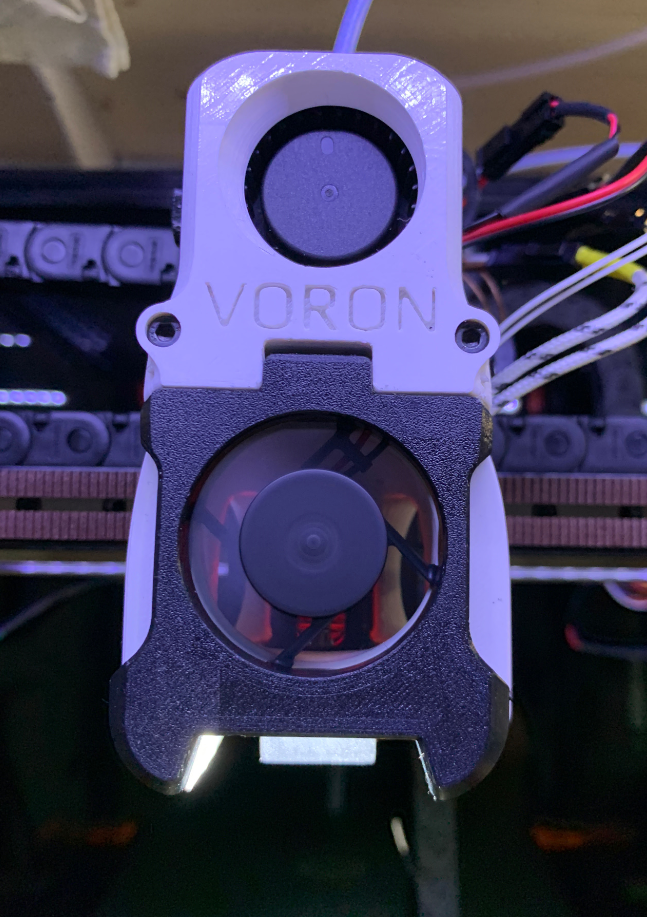

Magnetic LED hotend fan cover for Afterburner
=========================================

This mod adds an LED space and cable channel to he magnetic cover provided 
by arkeet

Required hardware
-----------------

- 6x3mm round magnet (2x)
- M3x8 SHCS — steel, not stainless (2x)

Instructions
------------

Press the magnets into the new cover. Screw the M3x8 screws into the toolhead
until they bottom out; the heads should protrude 4mm from the surface.

The LED (stripe) can by glued onto the 25degree surface and the cable can be routed via
the 2mm hole and the cable channel upwards. Easiest way to power the LED is to splice
the FAN power cable. Doing this the LED is switched on if the Hotend is running which should be fine.

In case you want to dimm it or control externally you need to put extra wires from your board.

Images
------

